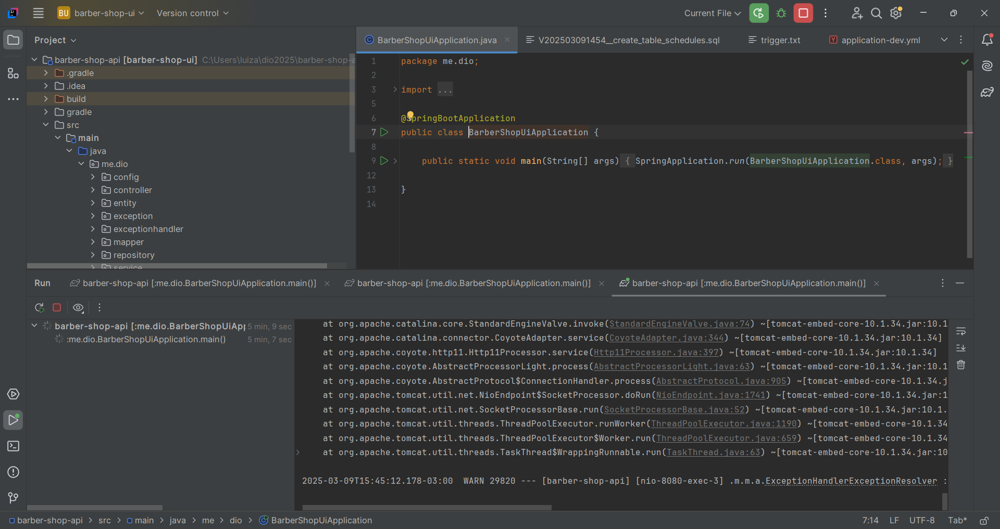
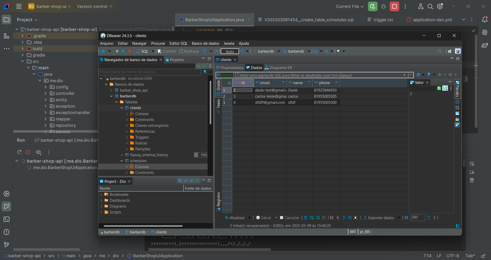
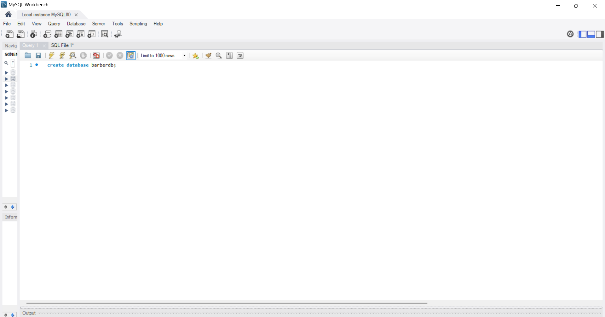

# 🏢 Barber Shop API - Aplicação Fullstack - BACKEND

Este repositório contém a aplicação **Barber Shop API**, um sistema fullstack desenvolvido com **Angular** no frontend e **Spring Boot** no backend. O objetivo do projeto é gerenciar clientes e agendamentos de forma eficiente.

---

## 🚀 Tecnologias Utilizadas

### 🖥️ Frontend

  
  
  
  
  

- **Bootstrap**: Framework CSS para design responsivo.
- **ngx-mask**: Biblioteca para aplicar máscaras de entrada.

### 🔙 Backend

  
  
  

- **Spring Boot**: Framework para criação de aplicações Java.
- **MySQL**: Banco de dados relacional utilizado no projeto.
- **DBeaver**: Cliente SQL para gerenciar o banco de dados.

---

## 🎯 Funcionalidades

✔️ Cadastro de clientes  
✔️ Listagem de clientes cadastrados  
✔️ Agendamento de horários  
✔️ Interface responsiva  
✔️ Diálogos de confirmação  

---

## ✨ Considerações Finais

Este foi meu primeiro desafio fullstack, e a experiência foi muito desafiadora. Conseguir reproduzir o projeto conforme as aulas, mesmo sem muitas melhorias, foi uma conquista válida e um aprendizado essencial para o desenvolvimento de aplicações fullstack.

📢 Este projeto foi desenvolvido para fins acadêmicos.

---

## 📷 Imagens do Projeto

  
  
  

